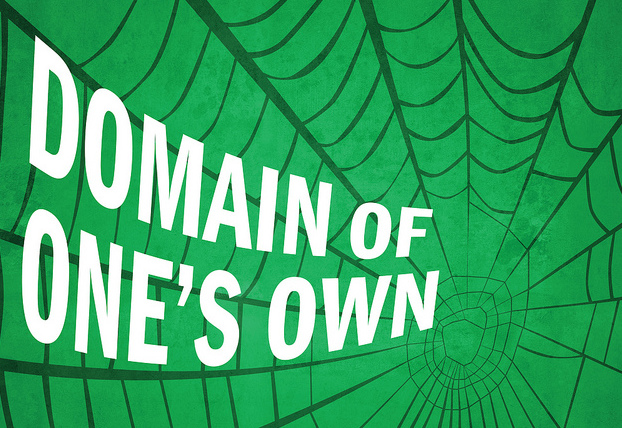

After hearing from a number of schools running Domain of One’s Own, we thought it might be useful to host an in-person workshop that focuses specifically on implementing this project on your campus. Workshop of One’s Own is a two-day, geared towards the instructional technologist who assists with managing DoOO on an administrator level, but also focuses on project conceptualization, instructional uses, and empowering their community from a teaching/learning standpoint. 

You’ll not only be receiving the in-person, focused attention from the entire Reclaim Hosting team, but you’ll also get a chance to brainstorm with folks from other schools who are running their own Domain of One’s Own projects. We’ll work through common troubleshooting tips, SPLOTs with Alan Levine, cPanel application case studies, and more.
